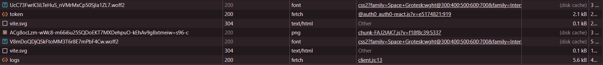
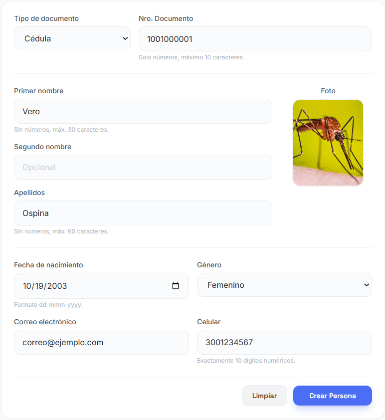
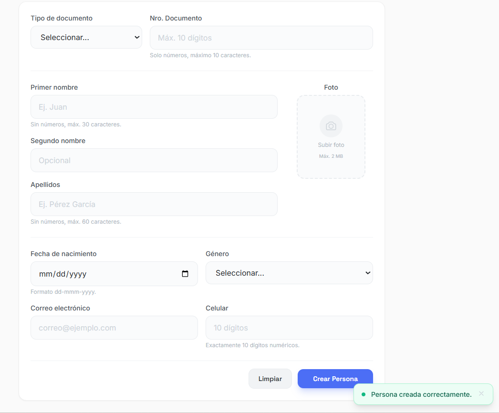
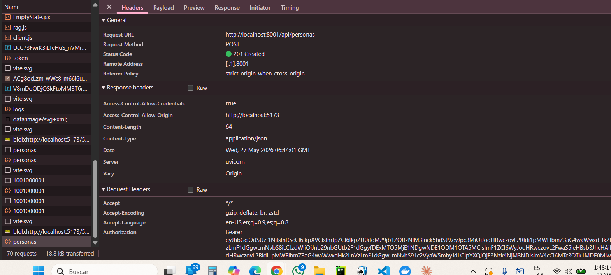
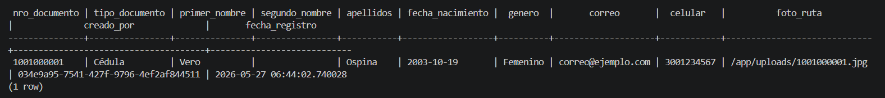
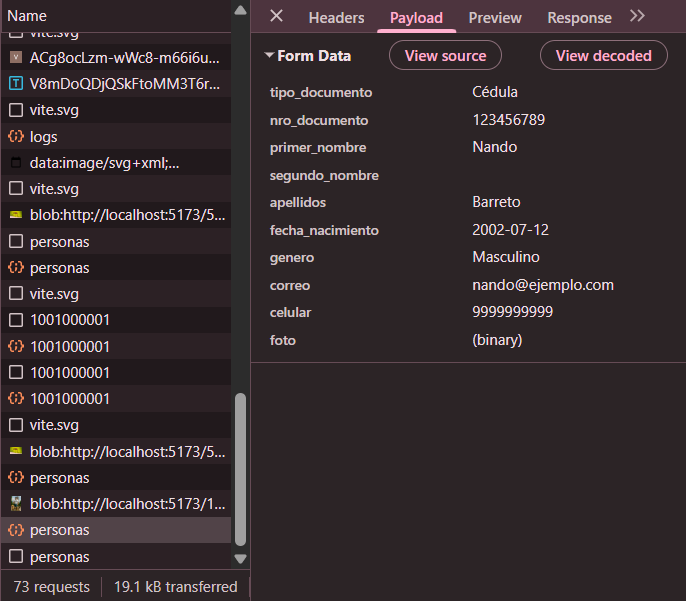
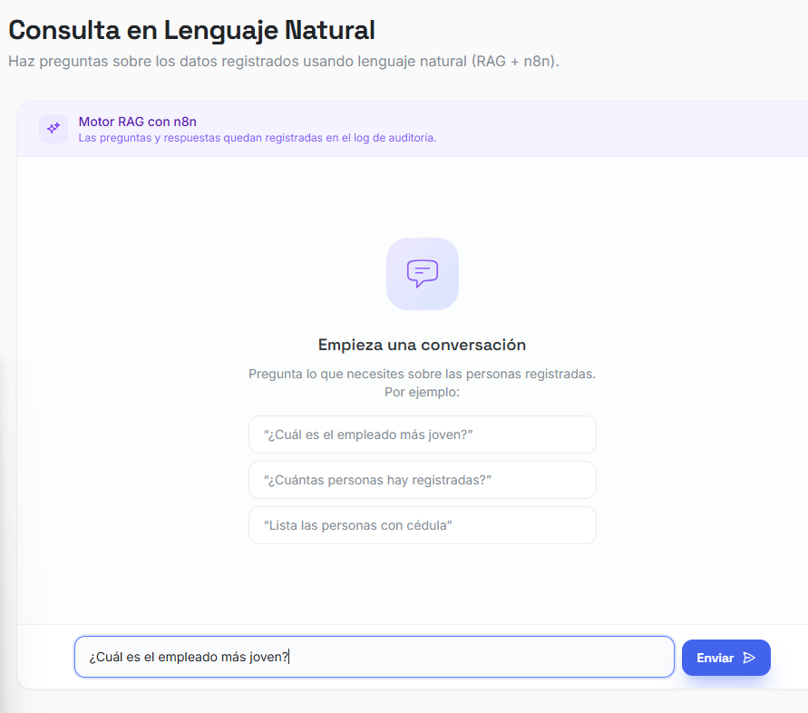
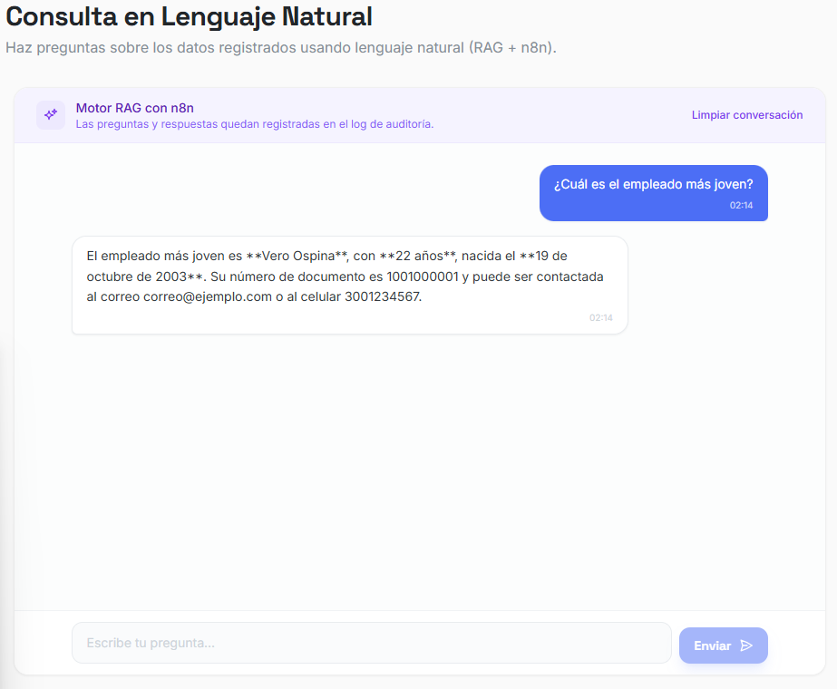
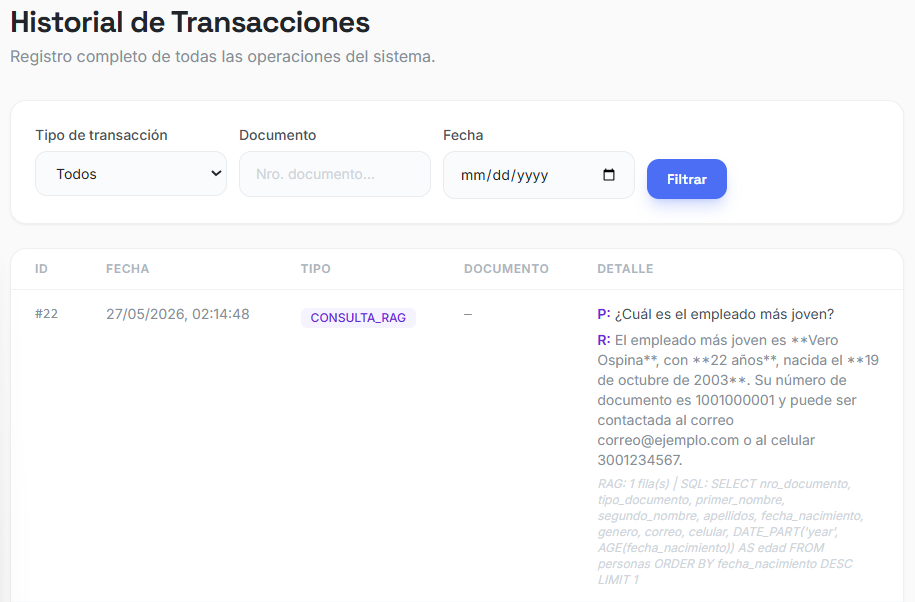

# Evidencias de pruebas E2E — ExplorApp


Las pruebas validan los tres casos de uso definidos en la **sección 10 del
documento de diseño** de ExplorApp.

---

## Información de la ejecución

| Campo                    | Valor                                              |
|--------------------------|----------------------------------------------------|
| Entorno                  | Docker Compose local (Windows 11)                  |
| Frontend                 | http://localhost:5173                              |
| ms-crear                 | http://localhost:8001                              |
| ms-modificar             | http://localhost:8002                              |
| ms-consultar             | http://localhost:8003                              |
| ms-borrar                | http://localhost:8004                              |
| ms-log                   | http://localhost:8005                              |
| n8n                      | http://localhost:5678                              |
| PostgreSQL               | `localhost:5432`                                   |


---

## Resumen de resultados

| # | Caso de uso                          | Resultado | Evidencia |
|---|--------------------------------------|-----------|-----------|
| 1 | Creación exitosa de persona          | ✅ Pasa | [caso1-creacion/](./caso1-creacion/) |
| 2 | Validación de celular (11 dígitos)   | ✅ Pasa | [caso2-validacion-celular/](./caso2-validacion-celular/) |
| 3 | RAG — empleado más joven             | ✅ Pasa | [caso3-rag/](./caso3-rag/) |


---

## Caso 1 — Creación exitosa

### Precondiciones

- Todos los microservicios `Up (healthy)` en `docker compose ps`.
- Base de datos `personas` vacía.
- Usuario con credenciales válidas de Auth0.

### Pasos ejecutados

1. Login con Auth0 desde el frontend.
2. Navegar al formulario *Crear persona*.
3. Diligenciar todos los campos con los datos de prueba.
4. Adjuntar la foto.
5. Hacer clic en *Guardar*.
6. Verificar respuesta HTTP `201 Created` en DevTools → Network.
7. Verificar registro insertado en la tabla `personas`.
8. Verificar entrada en la tabla `logs` con `tipo = 'CREACION'` y
   `documento_relacionado = '1001000001'`.

### Consultas SQL de verificación

```sql
-- Persona creada
SELECT nro_documento, nombres, apellidos, celular, email
FROM personas
WHERE nro_documento = '1001000001';

-- Log de creación
SELECT id, tipo, documento_relacionado, fecha
FROM logs
WHERE tipo = 'CREACION'
  AND documento_relacionado = '1001000001'
ORDER BY id DESC
LIMIT 1;
```

### Resultado esperado

- `POST /api/personas` responde `201` con el cuerpo del recurso creado.
- La tabla `personas` contiene exactamente 1 fila con `nro_documento = '1001000001'`.
- La tabla `logs` contiene una entrada con `tipo = 'CREACION'` y
  `documento_relacionado = '1001000001'`.

### Resultado obtenido

- Status HTTP: 201
- Filas en `personas`: 1

### Evidencia

| # | Archivo                                              | Descripción                                  |
|---|------------------------------------------------------|----------------------------------------------|
| 1 |         | Token de Auth0                               |
| 2 |          | Formulario lleno en el frontend              |
| 3 |        | Confirmación en el frontend                  |
| 4 |              | DevTools → Network: `POST` con status `201`  |
| 5 |               | Registro en la tabla `personas`              |

### Veredicto

✅ **Funciona a la perfección**

---

## Caso 2 — Validación de celular (11 dígitos)

### Precondiciones

- Frontend funcionando.
- Sesión iniciada con Auth0.

### Datos de prueba

| Campo     | Valor                  |
|-----------|------------------------|
| `celular` | `99999999999` (11 d.)  |
| Resto     | Datos válidos          |

### Pasos ejecutados

1. Abrir el formulario *Crear persona*.
2. Llenar todos los campos válidos.
3. Escribir `99999999999` en el campo *Celular*.
4. Intentar enviar el formulario.
5. Verificar que el campo muestra un mensaje de error inline.
6. Verificar en DevTools → Network que **no** se realizó request `POST /api/personas`.


### Resultado obtenido

- El frontend hace la validación y no deja escribir más de 10 dígitos en el campo del celular. Por más de que se pegue un texto con 11 dígitos, se anotan máximo 10.

### Evidencia

| # | Archivo                                                    | Descripción                                           |
|---|------------------------------------------------------------|-------------------------------------------------------|
| 1 |        | Solo se van 10 dígitos, se ignoran los demás          |

### Veredicto

✅ **Funciona a la perfección**

---

## Caso 3 — RAG (empleado más joven)

### Precondiciones

- Al menos 2 personas en la tabla `personas` con `fecha_nac` distintas.
- Workflow del RAG activo en n8n (`http://localhost:5678` → workflow *Active*).
- Frontend con el chat conectado al webhook de n8n.

### Pasos ejecutados

1. Abrir el chat del frontend.
2. Enviar la pregunta literal: **¿Cuál es el empleado más joven?**
3. Esperar respuesta de n8n.
4. Cruzar la respuesta con la consulta SQL
   `SELECT nombres, fecha_nac FROM personas ORDER BY fecha_nac DESC LIMIT 1`.
5. Verificar log `CONSULTA_RAG` en la tabla `logs`.


### Resultado esperado

- n8n responde en el chat indicando al empleado con la `fecha_nac` más
  reciente (es decir, el más joven).
- La respuesta coincide con la fila devuelta por la consulta SQL de control.

### Resultado obtenido

> Completar tras ejecutar.

- Respuesta de n8n: Vero
- Empleado más joven según SQL: Vero
- Coinciden: Sí

### Evidencia

| # | Archivo                                       | Descripción                                |
|---|-----------------------------------------------|--------------------------------------------|
| 1 |            | Pregunta enviada desde el chat             |
| 2 |           | Respuesta de n8n en el chat                |
| 4 |                 | SQL query correcto                         |

### Veredicto

✅ **Funciona a la perfección**

---


- [ ] Documento de evidencia enlazado desde el [`README.md`](../../README.md) raíz.
